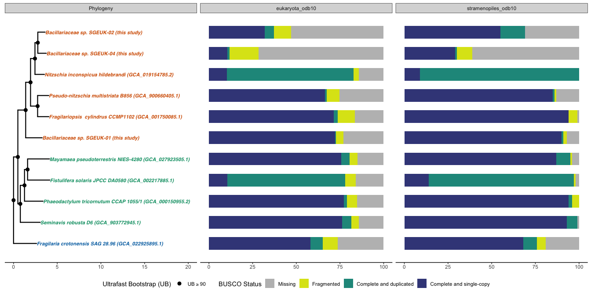
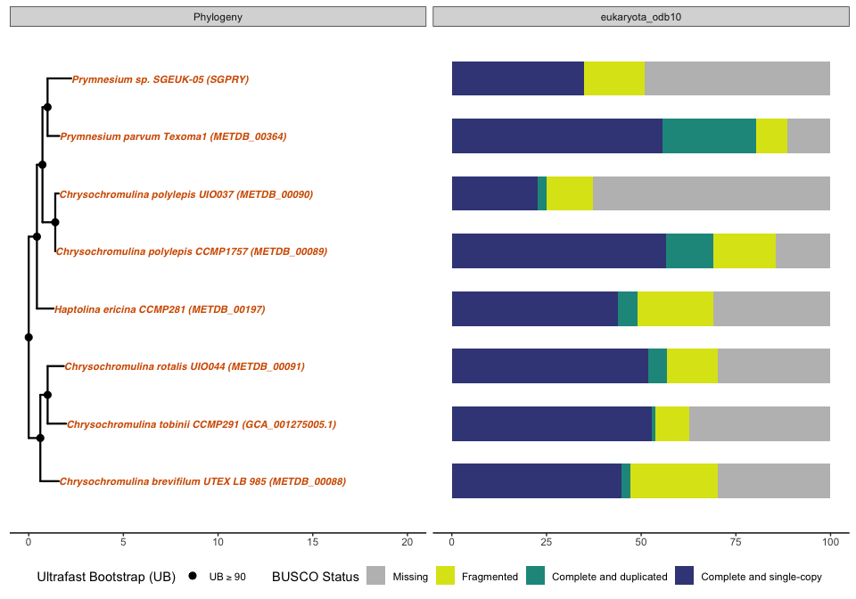
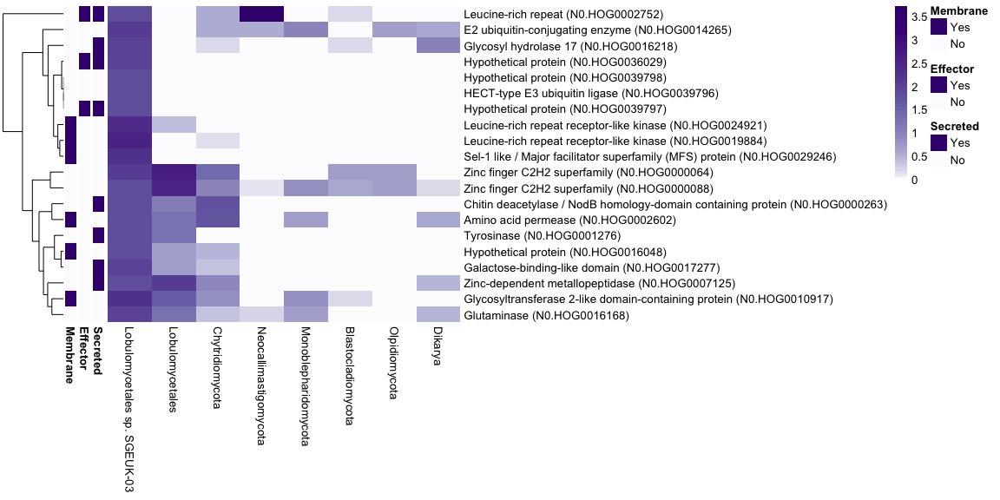

Eukaryotic MAGs recovered from deep metagenomic sequencing of the
seagrass, Zostera marina, include a novel chytrid in the order
Lobulomycetales
================
Cassie Ettinger

``` r
# Load libraries
library(tidyverse)
library(ggtree)
library(treeio)
library(ggplot2)
library(ape)
library(patchwork)
library(ggnewscale)
library(vroom)
library(RColorBrewer)
library(viridis)
library(ggplotify)
library(pheatmap)
library(UpSetR)
```

# Figure 1 - Fungal MAG

``` r
# Load in data
meta.mag.tre <- vroom("../data/phyling/Phyling_fungi_mag_subset_meta.txt")
chy.mag.tre <- read.newick("../data/phyling/Phyling_fungi_mag.tre")

# Get tree and parse Take a look at basic tree
# ggtree(chy.mag.tre, color = 'black', size=1, linetype =
# 1) + geom_tiplab(fontface = 'bold.italic', size = 5,
# offset = 0.001) + xlim(0,20) +
# geom_nodelab(aes(label=node))

# Subset tree
chy.mag.tre.sub <- tree_subset(chy.mag.tre, "SGCHY", levels_back = 3)

# Get taxa labels from tree
chy.mag.tre.sub.lab <- chy.mag.tre.sub$tip.label

# Now subset metadata
chy.mag.tre.sub.lab.meta <- meta.mag.tre %>%
    filter(label %in% chy.mag.tre.sub.lab)

# Join metadata with the tree
chy.mag.tre.sub.w.meta <- full_join(chy.mag.tre.sub, chy.mag.tre.sub.lab.meta,
    by = "label")

# Plot tree alone
chy.tre.w.meta.plot <- ggtree(chy.mag.tre.sub.w.meta, color = "black",
    size = 0.8, linetype = 1) + geom_tiplab(aes(label = PhyloName,
    color = Order), fontface = "bold.italic", size = 3, offset = 0.001) +
    scale_color_manual(values = c("#009E73", "#D55E00", "#0072B2",
        "#E69F00"), guide = "none") + geom_point2(aes(subset = !isTip,
    fill = cut(as.numeric(label), c(0, 70, 90, 100))), shape = 21,
    size = 2.5) + scale_fill_manual(values = c("black", "grey",
    "white"), guide = "legend", name = "Ultrafast Bootstrap (UB)",
    breaks = c("(90,100]", "(70,90]", "(0,70]"), labels = expression(UB >=
        90, 70 <= UB * " < 90", UB < 70)) + theme(legend.position = "bottom")


# chy.tre.w.meta.plot


# Reformat BUSCO stats for graphing
busco.stats.fun <- chy.mag.tre.sub.lab.meta %>%
    select(label, fungi_odb10_Single, fungi_odb10_Duplicated,
        fungi_odb10_Fragmented, fungi_odb10_Missing) %>%
    mutate(Mode = "fungi_odb10") %>%
    group_by(label) %>%
    gather(key = "busco_cat", value = "percent", fungi_odb10_Single,
        fungi_odb10_Duplicated, fungi_odb10_Fragmented, fungi_odb10_Missing) %>%
    mutate(busco_cat = ifelse(busco_cat == "fungi_odb10_Single",
        "Single", ifelse(busco_cat == "fungi_odb10_Duplicated",
            "Duplicated", ifelse(busco_cat == "fungi_odb10_Fragmented",
                "Fragmented", "Missing"))))


busco.stats.euk <- chy.mag.tre.sub.lab.meta %>%
    select(label, eukaryota_odb10_Single, eukaryota_odb10_Duplicated,
        eukaryota_odb10_Fragmented, eukaryota_odb10_Missing) %>%
    mutate(Mode = "eukaryota_odb10") %>%
    group_by(label) %>%
    gather(key = "busco_cat", value = "percent", eukaryota_odb10_Single,
        eukaryota_odb10_Duplicated, eukaryota_odb10_Fragmented,
        eukaryota_odb10_Missing) %>%
    mutate(busco_cat = ifelse(busco_cat == "eukaryota_odb10_Single",
        "Single", ifelse(busco_cat == "eukaryota_odb10_Duplicated",
            "Duplicated", ifelse(busco_cat == "eukaryota_odb10_Fragmented",
                "Fragmented", "Missing"))))


# Add factors to reorder categories for graphing
busco.stats.fun$busco_cat <- factor(busco.stats.fun$busco_cat,
    levels = c("Missing", "Fragmented", "Duplicated", "Single"))

busco.stats.euk$busco_cat <- factor(busco.stats.euk$busco_cat,
    levels = c("Missing", "Fragmented", "Duplicated", "Single"))

# Add BUSCO bar plots to tree plot
tree_plus <- chy.tre.w.meta.plot + theme(axis.title.x = element_text(),
    axis.text.x = element_text(), axis.ticks.x = element_line(),
    axis.line.x = element_line()) + new_scale_fill() + geom_facet(panel = "eukaryota_odb10",
    data = busco.stats.euk, geom = geom_bar, aes(x = percent,
        fill = busco_cat), orientation = "y", stat = "identity",
    position = "stack", width = 0.6) + geom_facet(panel = "fungi_odb10",
    data = busco.stats.fun, geom = geom_bar, aes(x = percent,
        fill = busco_cat), orientation = "y", stat = "identity",
    position = "stack", width = 0.6) + scale_fill_manual(labels = c(Single = "Complete and single-copy",
    Duplicated = "Complete and duplicated", Framgented = "Fragmented",
    Missing = "Missing"), values = c("grey", "#DCE318FF", "#1F968BFF",
    "#3F4788FF")) + guides(fill = guide_legend(title = "BUSCO Status")) +
    xlim_tree(20)

facet_labeller(tree_plus, c(Tree = "Phylogeny"))
```

<!-- -->

``` r
ggsave(filename = "../plots/figure1.pdf", plot = last_plot(),
    device = "pdf", width = 14, height = 7, dpi = 300)

ggsave(filename = "../plots/figure1.png", plot = last_plot(),
    device = "png", width = 14, height = 7, dpi = 300)
```

# Figure 2 - Diatom MAGs

``` r
# Load in data
diatom.meta.mag.tre <- vroom("../data/phyling/Phyling_diatom_mag_subset_meta.txt")
diatom.mag.tre <- read.newick("../data/phyling/Phyling_diatom_mag_eukset.tre")

# Get tree and parse Take a look at basic tree
# ggtree(diatom.mag.tre, color = 'black', size=1, linetype
# = 1) + geom_tiplab(fontface = 'bold.italic', size = 5,
# offset = 0.001) + xlim(0,20) +
# geom_nodelab(aes(label=node))

# Subset tree
diatom.mag.tre.sub <- tree_subset(diatom.mag.tre, "SGBAC", levels_back = 3)

# Remove duplicate tips
drop = c("GCF_000150955.2")  #duplicate tip
diatom.mag.tre.sub <- drop.tip(diatom.mag.tre.sub, drop)

# Get taxa labels from tree
diatom.mag.tre.sub.lab <- diatom.mag.tre.sub$tip.label

# Now subset metadata
diatom.mag.tre.sub.lab.meta <- diatom.meta.mag.tre %>%
    filter(label %in% diatom.mag.tre.sub.lab)

# Join metadata with the tree
diatom.mag.tre.sub.w.meta <- full_join(diatom.mag.tre.sub, diatom.mag.tre.sub.lab.meta,
    by = "label")


# Plot tree alone
diatom.tre.w.meta.plot <- ggtree(diatom.mag.tre.sub.w.meta, color = "black",
    size = 0.8, linetype = 1) + geom_tiplab(aes(label = PhyloName,
    color = Order), fontface = "bold.italic", size = 3, offset = 0.001) +
    scale_color_manual(values = c("#D55E00", "#0072B2", "#009E73",
        "#E69F00"), guide = "none") + geom_point2(aes(subset = !isTip,
    fill = cut(as.numeric(label), c(0, 70, 90, 100))), shape = 21,
    size = 2.5) + scale_fill_manual(values = c("black", "grey",
    "white"), guide = "legend", name = "Ultrafast Bootstrap (UB)",
    breaks = c("(90,100]", "(70,90]", "(0,70]"), labels = expression(UB >=
        90, 70 <= UB * " < 90", UB < 70)) + theme(legend.position = "bottom")


# diatom.tre.w.meta.plot


# Reformat BUSCO stats for graphing
diatom.busco.stats.str <- diatom.mag.tre.sub.lab.meta %>%
    select(label, stramenopiles_odb10_Single, stramenopiles_odb10_Duplicated,
        stramenopiles_odb10_Fragmented, stramenopiles_odb10_Missing) %>%
    mutate(Mode = "stramenopiles_odb10") %>%
    group_by(label) %>%
    gather(key = "busco_cat", value = "percent", stramenopiles_odb10_Single,
        stramenopiles_odb10_Duplicated, stramenopiles_odb10_Fragmented,
        stramenopiles_odb10_Missing) %>%
    mutate(busco_cat = ifelse(busco_cat == "stramenopiles_odb10_Single",
        "Single", ifelse(busco_cat == "stramenopiles_odb10_Duplicated",
            "Duplicated", ifelse(busco_cat == "stramenopiles_odb10_Fragmented",
                "Fragmented", "Missing"))))


diatom.busco.stats.euk <- diatom.mag.tre.sub.lab.meta %>%
    select(label, eukaryota_odb10_Single, eukaryota_odb10_Duplicated,
        eukaryota_odb10_Fragmented, eukaryota_odb10_Missing) %>%
    mutate(Mode = "eukaryota_odb10") %>%
    group_by(label) %>%
    gather(key = "busco_cat", value = "percent", eukaryota_odb10_Single,
        eukaryota_odb10_Duplicated, eukaryota_odb10_Fragmented,
        eukaryota_odb10_Missing) %>%
    mutate(busco_cat = ifelse(busco_cat == "eukaryota_odb10_Single",
        "Single", ifelse(busco_cat == "eukaryota_odb10_Duplicated",
            "Duplicated", ifelse(busco_cat == "eukaryota_odb10_Fragmented",
                "Fragmented", "Missing"))))


# Make factor to order BUSCO categories for graphing
diatom.busco.stats.str$busco_cat <- factor(diatom.busco.stats.str$busco_cat,
    levels = c("Missing", "Fragmented", "Duplicated", "Single"))

diatom.busco.stats.euk$busco_cat <- factor(diatom.busco.stats.euk$busco_cat,
    levels = c("Missing", "Fragmented", "Duplicated", "Single"))


# Plot tree and BUSCO bar charts
tree_plus <- diatom.tre.w.meta.plot + theme(axis.title.x = element_text(),
    axis.text.x = element_text(), axis.ticks.x = element_line(),
    axis.line.x = element_line()) + new_scale_fill() + geom_facet(panel = "eukaryota_odb10",
    data = diatom.busco.stats.euk, geom = geom_bar, aes(x = percent,
        fill = busco_cat), orientation = "y", stat = "identity",
    position = "stack", width = 0.6) + geom_facet(panel = "stramenopiles_odb10",
    data = diatom.busco.stats.str, geom = geom_bar, aes(x = percent,
        fill = busco_cat), orientation = "y", stat = "identity",
    position = "stack", width = 0.6) + scale_fill_manual(labels = c(Single = "Complete and single-copy",
    Duplicated = "Complete and duplicated", Framgented = "Fragmented",
    Missing = "Missing"), values = c("grey", "#DCE318FF", "#1F968BFF",
    "#3F4788FF")) + guides(fill = guide_legend(title = "BUSCO Status")) +
    xlim_tree(20)

facet_labeller(tree_plus, c(Tree = "Phylogeny"))
```

<!-- -->

``` r
ggsave(filename = "../plots/figure2.pdf", plot = last_plot(),
    device = "pdf", width = 14, height = 7, dpi = 300)
ggsave(filename = "../plots/figure2.png", plot = last_plot(),
    device = "png", width = 14, height = 7, dpi = 300)
```

# Figure 3 - Haptophyte MAG

``` r
# Load in data
hapt.meta.mag.tre <- vroom("../data/phyling/Phyling_hapt_mag_subset_meta.txt")
hapt.mag.tre <- read.newick("../data/phyling/Phyling_hapt_mag_eukset.tre")

# Get tree and parse Take a look at basic tree
# ggtree(hapt.mag.tre, color = 'black', size=1, linetype =
# 1) + geom_tiplab(fontface = 'bold.italic', size = 5,
# offset = 0.001) + xlim(0,20) +
# geom_nodelab(aes(label=node))

# Subset tree
hapt.mag.tre.sub <- tree_subset(hapt.mag.tre, "SGPRY", levels_back = 4)

# Get taxa labels from tree
hapt.mag.tre.sub.lab <- hapt.mag.tre.sub$tip.label

# Now subset metadata
hapt.mag.tre.sub.lab.meta <- hapt.meta.mag.tre %>%
    filter(label %in% hapt.mag.tre.sub.lab)

# Join metadata with the tree
hapt.mag.tre.sub.w.meta <- full_join(hapt.mag.tre.sub, hapt.mag.tre.sub.lab.meta,
    by = "label")


# Plot tree alone
hapt.tre.w.meta.plot <- ggtree(hapt.mag.tre.sub.w.meta, color = "black",
    size = 0.8, linetype = 1) + geom_tiplab(aes(label = PhyloName,
    color = Order), fontface = "bold.italic", size = 3, offset = 0.001) +
    scale_color_manual(values = c("#D55E00", "#0072B2", "#009E73",
        "#E69F00"), guide = "none") + geom_point2(aes(subset = !isTip,
    fill = cut(as.numeric(label), c(0, 70, 90, 100))), shape = 21,
    size = 2.5) + scale_fill_manual(values = c("black", "grey",
    "white"), guide = "legend", name = "Ultrafast Bootstrap (UB)",
    breaks = c("(90,100]", "(70,90]", "(0,70]"), labels = expression(UB >=
        90, 70 <= UB * " < 90", UB < 70)) + theme(legend.position = "bottom")


# hapt.tre.w.meta.plot


# Reformat BUSCO stats for graphing

hapt.busco.stats.euk <- hapt.mag.tre.sub.lab.meta %>%
    select(label, eukaryota_odb10_Single, eukaryota_odb10_Duplicated,
        eukaryota_odb10_Fragmented, eukaryota_odb10_Missing) %>%
    mutate(Mode = "eukaryota_odb10") %>%
    group_by(label) %>%
    gather(key = "busco_cat", value = "percent", eukaryota_odb10_Single,
        eukaryota_odb10_Duplicated, eukaryota_odb10_Fragmented,
        eukaryota_odb10_Missing) %>%
    mutate(busco_cat = ifelse(busco_cat == "eukaryota_odb10_Single",
        "Single", ifelse(busco_cat == "eukaryota_odb10_Duplicated",
            "Duplicated", ifelse(busco_cat == "eukaryota_odb10_Fragmented",
                "Fragmented", "Missing"))))


# Make a factor for graphing
hapt.busco.stats.euk$busco_cat <- factor(hapt.busco.stats.euk$busco_cat,
    levels = c("Missing", "Fragmented", "Duplicated", "Single"))

# Plot tree and BUSCO bar charts
tree_plus <- hapt.tre.w.meta.plot + theme(axis.title.x = element_text(),
    axis.text.x = element_text(), axis.ticks.x = element_line(),
    axis.line.x = element_line()) + new_scale_fill() + geom_facet(panel = "eukaryota_odb10",
    data = hapt.busco.stats.euk, geom = geom_bar, aes(x = percent,
        fill = busco_cat), orientation = "y", stat = "identity",
    position = "stack", width = 0.6) + scale_fill_manual(labels = c(Single = "Complete and single-copy",
    Duplicated = "Complete and duplicated", Framgented = "Fragmented",
    Missing = "Missing"), values = c("grey", "#DCE318FF", "#1F968BFF",
    "#3F4788FF")) + guides(fill = guide_legend(title = "BUSCO Status")) +
    xlim_tree(20)

facet_labeller(tree_plus, c(Tree = "Phylogeny"))
```

<!-- -->

``` r
ggsave(filename = "../plots/figure3.pdf", plot = last_plot(),
    device = "pdf", width = 10, height = 7, dpi = 300)
ggsave(filename = "../plots/figure3.png", plot = last_plot(),
    device = "png", width = 10, height = 7, dpi = 300)
```

# Figure 4 - Fungal SSU

``` r
# load in data
meta.tre <- vroom("../data/18S/SSU_fungi_tree_meta.txt")
```

    ## Rows: 30 Columns: 7
    ## ── Column specification ────────────────────────────────────────────────────────
    ## Delimiter: "\t"
    ## chr (7): Clade, Species, Strain, GenBank Assession, label, PhyloName, TipColor
    ## 
    ## ℹ Use `spec()` to retrieve the full column specification for this data.
    ## ℹ Specify the column types or set `show_col_types = FALSE` to quiet this message.

``` r
chy.tre <- read.newick("../data/18S/SSU_fungi_mag_ssualign.tre")

# Reroot

chy.root.tre <- root(chy.tre, node = 45, edgelabel = TRUE)

# Get tree and parse

# Take a look at basic tree ggtree(chy.root.tre, color =
# 'black', size=1, linetype = 1) + geom_tiplab(fontface =
# 'bold.italic', size = 5, offset = 0.001) + xlim(0,3) +
# geom_nodelab(aes(label=node))

# Get taxa labels from tree
chy.tre.lab <- chy.root.tre$tip.label

# Now subset metadata
chy.tre.lab.meta <- meta.tre %>%
    filter(label %in% chy.tre.lab)

# Join metadata with the tree
chy.tre.w.meta <- full_join(chy.root.tre, chy.tre.lab.meta, by = "label")

# Get and add bootstraps
bootstraps <- data.frame(as.numeric(chy.root.tre$node.label))
bootstraps$as.numeric.chy.root.tre.node.label.[1] = 100
bootstraps$bootstrap <- bootstraps$as.numeric.chy.root.tre.node.label.
bootstraps <- bootstraps[-c(1)]
bootstraps$node <- chy.tre.w.meta@extraInfo$node[29:54]

chy.tre.w.meta.bs <- full_join(chy.tre.w.meta, bootstraps, by = "node")

# Plot tree
chy.tre.w.meta.plot <- ggtree(chy.tre.w.meta.bs, color = "black",
    size = 0.8, linetype = 1) + geom_tiplab(aes(label = PhyloName,
    color = Clade), fontface = "bold.italic", size = 3, offset = 0.001) +
    scale_color_manual(values = c("#009E73", "#D55E00", "#0072B2",
        "#E69F00"), guide = "none") + geom_cladelab(node = 45,
    label = "Lobulomycetales", align = TRUE, geom = "label",
    fill = "#D55E00", barcolor = "#D55E00", textcolor = "white",
    offset = 0.2, barsize = 1.5) + geom_cladelab(node = 46, label = "Gromochytriales",
    align = TRUE, geom = "label", fill = "#009E73", barcolor = "#009E73",
    textcolor = "white", offset = 0.2, barsize = 1.5) + geom_cladelab(node = 9,
    label = "Mesochytriales", align = TRUE, geom = "label", fill = "#0072B2",
    barcolor = "#0072B2", textcolor = "white", offset = 0.2,
    barsize = 1.5) + xlim(0, 0.5) + geom_point2(aes(subset = !isTip,
    fill = cut(bootstrap, c(0, 70, 90, 100))), shape = 21, size = 2.5) +
    scale_fill_manual(values = c("black", "grey", "white"), guide = "legend",
        name = "Ultrafast Bootstrap (UB)", breaks = c("(90,100]",
            "(70,90]", "(0,70]"), labels = expression(UB >= 90,
            70 <= UB * " < 90", UB < 70)) + theme(legend.position = "bottom") +
    geom_cladelab(node = 34, label = "Novel Clade SW-I", align = TRUE,
        geom = "label", fill = "#473D92", barcolor = "#473D92",
        textcolor = "white", offset = 0.22, barsize = 1.5)


chy.tre.w.meta.plot
```

<!-- -->

``` r
ggsave(filename = "../plots/figure4.pdf", plot = last_plot(),
    device = "pdf", width = 9, height = 6, dpi = 300)

ggsave(filename = "../plots/figure4.png", plot = last_plot(),
    device = "png", width = 9, height = 6, dpi = 300)
```

# Figure 5 - Comparative genomics

``` r
# Load in metadata
OG.meta <- vroom("../data/orthofinder/ortho_chytrid_meta.txt")

# Load in HOGs and OGs
N0 <- vroom("../data/orthofinder/N0.GeneCount.csv")  #everything - includes dikarya
OG <- vroom("../data/orthofinder/Orthogroups.GeneCount.tsv")

# Load in genes mapped to OGs
genes_in_OG <- vroom("../data/orthofinder/Orthogroups.tsv")

# Get SGEUK-03 genes in OGs
sg_genes_in_og <- genes_in_OG %>%
    select(Orthogroup, SGCHY.aa) %>%
    filter(!is.na(SGCHY.aa)) %>%
    mutate(SGCHY.aa = str_replace_all(SGCHY.aa, "SGCHY[|]", "")) %>%
    separate_longer_delim(SGCHY.aa, delim = ", ")

# Load in SGEUK-03 annotations
annotations <- vroom("../data/funannotate_results/W_METABAT__21.annotations.txt")
secret <- vroom("../data/funannotate_results/SGCHY.effector3p.txt")

# Add effector predictions to annotations
annotations_w_effectors <- full_join(annotations, secret, by = c(TranscriptID = "Identifier"))

# Add orthogroup assigment to annotations
annotations_w_effectors_and_og <- full_join(annotations_w_effectors,
    sg_genes_in_og, by = c(TranscriptID = "SGCHY.aa"))

# 86.8% of genes in orthogroups ; 2.8% in species specific
# orthogroups

# Calculate average orthogroup counts for heatmaps
OG.tots.counts.mean <- N0 %>%
    mutate(Dikarya = rowMeans(across(OG.meta$OGName[OG.meta$Phylum ==
        "Ascomycota" | OG.meta$Phylum == "Basidiomycota"]))) %>%
    mutate(Blastocladiomycota = rowMeans(across(OG.meta$OGName[OG.meta$Phylum ==
        "Blastocladiomycota"]))) %>%
    mutate(Neocallimastigomycota = rowMeans(across(OG.meta$OGName[OG.meta$Phylum ==
        "Neocallimastigomycota"]))) %>%
    mutate(Monoblepharidomycota = rowMeans(across(OG.meta$OGName[OG.meta$Phylum ==
        "Monoblepharidomycota"]))) %>%
    mutate(Olpidiomycota = rowMeans(across(OG.meta$OGName[OG.meta$Phylum ==
        "Olpidiomycota"]))) %>%
    mutate(Chytridiomycota = rowMeans(across(OG.meta$OGName[OG.meta$Phylum ==
        "Chytridiomycota" & OG.meta$Order != "Lobulomycetales"]))) %>%
    mutate(Lobulomycetales = rowMeans(across(OG.meta$OGName[OG.meta$Order ==
        "Lobulomycetales" & OG.meta$OGName != "SGCHY.aa"]))) %>%
    mutate(NonChytridFungi = rowMeans(across(OG.meta$OGName[OG.meta$Phylum ==
        "Blastocladiomycota" | OG.meta$Phylum == "Olpidiomycota" |
        OG.meta$Phylum == "Neocallimastigomycota" | OG.meta$Phylum ==
        "Monoblepharidomycota" | OG.meta$Phylum == "Dikarya"])))

# Filter out low abundance genes
og.tots.mean.heat <- OG.tots.counts.mean %>%
    select(HOG, OG, Dikarya, Blastocladiomycota, Neocallimastigomycota,
        Monoblepharidomycota, Olpidiomycota, Chytridiomycota,
        Lobulomycetales, SGCHY.aa) %>%
    filter(SGCHY.aa > 4)

# og.tots.mean.heat.pa <- og.tots.mean.heat %>%
# mutate(across(colnames(og.tots.mean.heat[-c(1,2)]),~1-as.numeric(.=='0')))

# Save annotation information for these genes
# annotations_w_effectors_and_og.subOG <-
# annotations_w_effectors_and_og %>% filter(Orthogroup %in%
# og.tots.mean.heat$OG)

# write_tsv(annotations_w_effectors_and_og.subOG,
# 'annotations.hogs.tsv')

# Import curated annotation information for these genes
annot.ogs_abun <- vroom("../data/orthofinder/OG.annotation.txt")

og.tots.mean.heat.meta <- left_join(og.tots.mean.heat, annot.ogs_abun)

# Replace NA's for plotting
og.tots.mean.heat.meta <- og.tots.mean.heat.meta %>%
    mutate(Effector = replace_na(Effector, "No")) %>%
    mutate(Membrane = replace_na(Membrane, "No")) %>%
    mutate(Secreted = replace_na(Secreted, "No"))

# Set up metadata for plotting
og.tots.mean.heat.df <- as.data.frame(og.tots.mean.heat.meta)

colnames(og.tots.mean.heat.df) <- c("HOG", "OG", "Dikarya", "Blastocladiomycota",
    "Neocallimastigomycota", "Monoblepharidomycota", "Olpidiomycota",
    "Chytridiomycota", "Lobulomycetales", "Lobulomycetales sp. SGEUK-03",
    "Function", "Secreted", "Membrane", "Effector")

col_order = c("HOG", "OG", "Lobulomycetales sp. SGEUK-03", "Lobulomycetales",
    "Chytridiomycota", "Neocallimastigomycota", "Monoblepharidomycota",
    "Blastocladiomycota", "Olpidiomycota", "Dikarya", "Function",
    "Secreted", "Effector", "Membrane")

og.tots.mean.heat.df <- og.tots.mean.heat.df[, col_order]

# Define annotation colors
ann_colors = list(Secreted = c(Yes = "#3F007D", No = "#FCFBFD"),
    Membrane = c(Yes = "#3F007D", No = "#FCFBFD"), Effector = c(Yes = "#3F007D",
        No = "#FCFBFD"))

rownames(og.tots.mean.heat.df) <- paste(og.tots.mean.heat.df$Function,
    " (", og.tots.mean.heat.df$HOG, ")", sep = "")

# Plot heatmap
ph <- as.ggplot(pheatmap(log(og.tots.mean.heat.df[-c(1, 2, 11,
    12, 13, 14)] + 1), cluster_cols = FALSE, annotation_row = og.tots.mean.heat.df[-c(1:11)],
    annotation_colors = ann_colors, color = colorRampPalette(brewer.pal(9,
        "Purples"), bias = 2)(90)))
```

<!-- -->

``` r
# ph

ggsave(filename = "../plots/figure5.pdf", plot = last_plot(),
    device = "pdf", width = 12, height = 6, dpi = 300)
ggsave(filename = "../plots/figure5.png", plot = last_plot(),
    device = "png", width = 12, height = 6, dpi = 300)
```

# Figure S1 - Fungal annotation

``` r
# Plot effector profile

eff.figs1a <- annotations_w_effectors_and_og %>%
    mutate(Prediction = ifelse(Prediction == "Cytoplasmic/apoplastic effector",
        "Apoplastic/cytoplasmic effector", as.character(Prediction))) %>%
    filter(!is.na(Prediction)) %>%
    group_by(Prediction) %>%
    tally() %>%
    ggplot(aes(x = Prediction, fill = Prediction, y = n)) + theme_bw() +
    geom_bar(stat = "identity", position = "stack", width = 0.6) +
    coord_flip() + scale_fill_viridis_d(option = "G", direction = -1) +
    ylab("Number of secreted genes") + xlab("") + theme(legend.position = "none") +
    scale_x_discrete(limits = rev)


# Plot CAZYme profile
cazy.figs1b <- annotations_w_effectors_and_og %>%
    filter(!is.na(CAZyme)) %>%
    mutate(CAZ = ifelse(str_detect(CAZyme, "AA"), "Auxiliary activities (AAs)",
        ifelse(str_detect(CAZyme, "CBM"), "Carbohydrate-binding modules (CBMs)",
            ifelse(str_detect(CAZyme, "CE"), "Carbohydrate esterases (CEs)",
                ifelse(str_detect(CAZyme, "GH"), "Glycoside hydrolases (GHs)",
                  ifelse(str_detect(CAZyme, "GT"), "Glycosyltransferases (GTs)",
                    "Polysaccharide lyases (PLs)")))))) %>%
    group_by(CAZ, CAZyme) %>%
    tally() %>%
    ggplot(aes(x = CAZ, fill = CAZ, y = n)) + theme_bw() + geom_bar(stat = "identity",
    position = "stack", width = 0.6) + coord_flip() + scale_fill_viridis_d(option = "G",
    direction = -1) + ylab("Number of CAZymes") + xlab("") +
    theme(legend.position = "none") + scale_x_discrete(limits = rev)


eff.figs1a + cazy.figs1b + plot_annotation(tag_levels = "A")
```

<!-- -->

``` r
ggsave(filename = "../plots/figs1.pdf", plot = last_plot(), device = "pdf",
    width = 10, height = 4, dpi = 300)
ggsave(filename = "../plots/figs1.png", plot = last_plot(), device = "png",
    width = 10, height = 4, dpi = 300)
```
